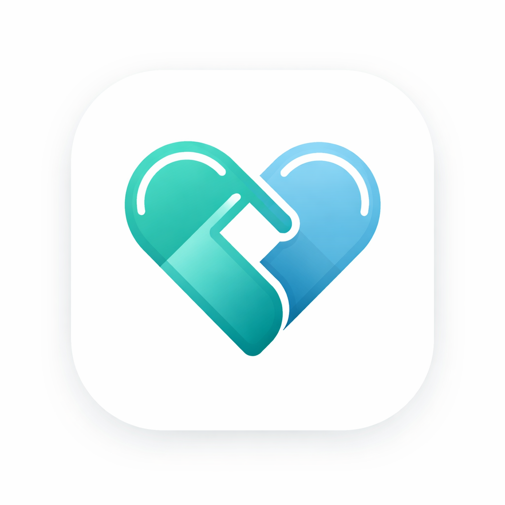

# 🏥 HealthSync: Premium Medicine & Family Monitor

<p align="center">
  
</p>

<p align="center">
  <strong>The ultimate glassmorphic medication reminder and family synchronization ecosystem.</strong>
</p>

<p align="center">
  
  
  
</p>

---

## ✨ Experience the Future of Caretelling

HealthSync isn't just a reminder app; it's a bridge between care and technology. Designed with a **Premium Glassmorphic UI**, it provides a soothing, high-contrast experience for patients while offering powerful real-time monitoring for caregivers.

### 🛡️ Core Pillars

*   **🧪 Intelligent Scheduling**: Add complex medication cycles with personalized reminders and meal relations.
*   **👨‍👩‍👧‍👦 Family Sync**: Real-time adherence tracking. Caregivers get notified the second a dose is missed or an emergency is triggered.
*   **🚨 SOS Protocol**: One-tap emergency alerts that bypass silent modes to reach family members instantly.
*   **📊 Adherence Intelligence**: Deep insights into medication history with automated missed-dose detection.
*   **🔒 Fort-Knox Security**: Production-grade Firestore rules ensuring data is ONLY visible to approved caregivers.

---

## 🛠️ Tech Stack & Architecture

| Layer | Technology |
| :--- | :--- |
| **Frontend** | React Native (Expo) |
| **Styling** | Vanilla CSS-in-JS + Glassmorphism |
| **State** | Zustand (Global Persistence) |
| **Backend** | Firebase (Auth, Firestore) |
| **Realtime** | Firestore Snapshots & Triggers |
| **Push** | Expo Push Notifications |

---

## 🚀 Deployment & Build

The project is pre-configured for **EAS (Expo Application Services)** production builds.

### To generate a Preview APK:
```bash
eas build -p android --profile preview
```

### Development Setup:
1.  Clone & Install: `npm install`
2.  Setup Env: Create `.env` with your Firebase config.
3.  Launch: `npx expo start`

---

## 🎨 Design Language

HealthSync utilizes a **Dynamic Design** system:
- **Primary Color**: `#19e66f` (Vibrant Emerald)
- **Aesthetics**: Translucent surfaces, subtle micro-animations (via Reanimated), and modern typography.
- **Adaptive Icons**: Fully optimized for Android 13+ themed icons and bouncy adaptive launcher effects.

---

<p align="center">
  Built with ❤️ by HealthSync Team
</p>
